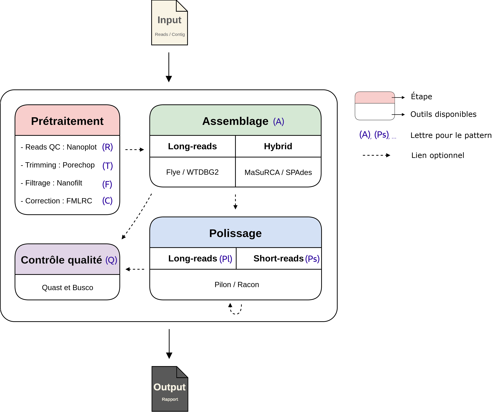

# FLORA 
----------
**FLORA** stands for _**F**or **LO**ng **R**ead **A**ssembly_. It's basically a modular pipeline in
order to assemble long-read from Oxford Nanopore Technologie. It was design to be run with
correction step thanks to short-reads. 

FLORA need a pattern to known which tools to launch when. You can chain multiple times
the same tool.



For example, the pattern **FARpQBRcQB** launch these step in this order : 

  - **F**ilter 
  - **A**ssembly 
  - **R**acon (**p**olishing with long-read) 
  - **Q**uast 
  - **B**usco 
  - **R**acon (**c**orrection with short-read) 
  - **Q**uast 
  - **B**usco 


See list below for available option :

```
	AVAILABLE OPTION

Trim..........................T
Filter........................F
Correct.......................C
Assemble......................A
Quast.........................Q
Busco.........................B
Racon correct.................Rc
Racon polish..................Rp
Nanopolish correct............Nc
Nanopolish polish.............Np
Pilon correct.................Pc
Pilon polish..................Pp
```

Currently, there is only two assembler supported, Flye and WTDBG2. I've planned to add Spades and MaSurCA for hybrid assembly.

```
	ASSEMBLER LIST

Flye..........................F
WTDBG2........................W
Spades.......................S
MaSuRCA......................M
```


# Help
--------
```
usage: FLORA.py [-h] [-i CONTIG] [-r READ] [-c CORRECT]
                [-a {Flye,F,WTDBG2,W,Spades,S}] [-p PATTERN] [-u] [-t THREAD]
                [-m RAM] [-q QUALITY] [-l LENGTH] [-e ESTIMATE] [-al]
                [-o OUTPUT] [-d DIR]

optional arguments:
  -h, --help            show this help message and exit
  -i CONTIG, --contig CONTIG
                        Input contig files.
  -r READ, --read READ  Input long-read in fastq format. WARNING, you must
                        have the read in fasta format with the exact same name
                        in the same directory than the fastq file.
  -c CORRECT, --correction CORRECT
                        Input read used for correction
  -a {Flye,F,WTDBG2,W,Spades,S}, --assembler {Flye,F,WTDBG2,W,Spades,S}
                        ID of the assembler you want to use (option
                        --assembler_list or -al for the list)
  -p PATTERN, --pattern PATTERN
                        Launch tools in the order of the pattern (ex:
                        FTAQBRcQBRcQB). See --tuto (-u) for a little help and
                        list of letter available
  -u, --tuto            Display a little help and list of letter available for
                        the pattern option
  -t THREAD, --thread THREAD
                        Max number of CPU thread available for the tools
                        (default = 8).
  -m RAM, --ram RAM     Max giga of RAM available for the tools (default =
                        64G).
  -q QUALITY, --quality QUALITY
                        Quality threshold for filter by NanoFilt (only usefull
                        if Filter step (F) is in pattern).
  -l LENGTH, --length LENGTH
                        Length threshold for filter by NanoFilt (only usefull
                        if Filter step (F) is in pattern).
  -e ESTIMATE, --estimate ESTIMATE
                        Estimate size of the input genome (ex: 80m).
  -al, --assembler_list
                        Display the list of ID of assembler available
  -o OUTPUT, --output OUTPUT
                        ID of the run. It will use this ID for output prefix.
  -d DIR, --dir DIR     Directory to stock result (default = ./FLORA_OUT/).
```

