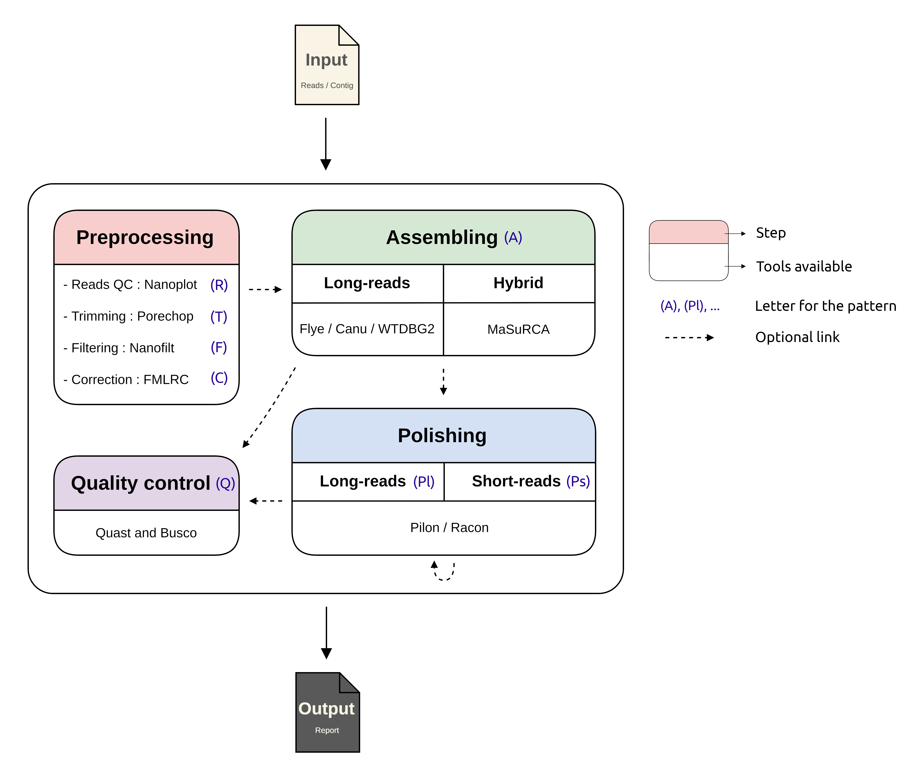

<!-- # FLORA -->

<p align="center"> 
  
</p>
<!---->

----------
**FLORA** stands for _**F**or **LO**ng **R**ead **A**ssembly_. It's basically a modular pipeline in
order to assemble long-read from Oxford Nanopore Technologie. It was design to be run with
correction step thanks to short-reads. 

<!---->


# Installation

Execute the script setup.py which will create a config file named "config". This file will contain path to all of the executable that FLORA will need. So if your dependencies are installed in a conda environnement for example, make sure you activate it before you run setup.py.
```
python3 setup.py
```
Make sure to check if all the path are correct and feel free to modify them directly, useful if you want to use another version of a tool or if the path tool isn't include in the variable $PATH).

# Dependencies

* Python3  
* [Jellyfish](https://github.com/gmarcais/Jellyfish)  
* [NanoPlot](https://github.com/wdecoster/nanoplot)  
* [Porechop](https://github.com/rrwick/Porechop)  
* [Nanofilt](https://github.com/wdecoster/nanofilt)  
* [RopeBWT2](https://github.com/lh3/ropebwt2)  
* [FMLRC](https://github.com/holtjma/fmlrc)  
* [Flye](https://github.com/fenderglass/Flye)  
* [Canu](https://github.com/fenderglass/Flye)  
* [WTDBG2](https://github.com/ruanjue/wtdbg2)  
* [MaSuRCA](https://github.com/alekseyzimin/masurca)  
* [Minimap2](https://github.com/lh3/minimap2)  
* [BWA](https://github.com/lh3/bwa)    
* [Samtools](https://github.com/samtools/samtools)  
* [Pilon](https://github.com/broadinstitute/pilon)  
* [Racon](https://github.com/isovic/racon)   
* [QUAST](https://github.com/ablab/quast)  
* [BUSCO](https://busco.ezlab.org/)  

You are not forced to install all of this tools, for example if you don't want to use the assembler MaSuRCA you can forget it or if you want to use only NanoPlot and NanoFlit you can install only these two.
Make sure that they are added to the $PATH variable or you will need to modify manually the config file (generated by setup.py, see [Installation](#Installation))

# How to use 

FLORA need a pattern to known which tools to launch when.
For example the pattern AQ launch a Assembly then Quality (Quast and Busco).

You can chain multiple times the same tool.

For example, the pattern **RFAPlQPsQ** launch these step in this order : 

  - **R**eads quality control
  - **F**ilter 
  - **A**ssembly 
  - **P**olish **l**ong-read
  - **Q**uality control (Quast and Busco)
  - **P**olish **s**hort-read
  - **Q**uality control (Quast and Busco)

See list below for available option :
```
Estimate......................E
Read quality..................R
Trim..........................T
Filter........................F
Correct.......................C
Assemble......................A
Quality control...............Q
Polish short-read.............Ps
Polish long-read..............Pl
```

Currently, there is four assembler supported :

```
Flye..........................F
Canu..........................C
WTDBG2........................W
Masurca.......................M
```


# Help
--------
```
usage: FLORA.py [-h] [-i CONTIG] [-r READ] [-c CORRECT] [-sr1 SHORTREAD1]
                [-sr2 SHORTREAD2]
                [-a {Flye,F,WTDBG2,W,Spades,S,MaSuRCA,M,Canu,C}]
                [-po {Pilon,P,Racon,R}] [-p PATTERN] [-u] [-t THREAD] [-m RAM]
                [-q QUALITY] [-l LENGTH] [-e ESTIMATE] [-k KMER] [-al] [-pl]
                [-o OUTPUT] [-d DIR] [-re RETRY] [-ro {nano-raw,nano-corr}]
                [-ao {minimap2,bwa}] [-f]

optional arguments:
  -h, --help            show this help message and exit
  -i CONTIG, --contig CONTIG
                        Input contig files.
  -r READ, --read READ  Input long-read in fastq format. WARNING, you must
                        have the read in fasta format with the exact same name
                        in the same directory than the fastq file.
  -c CORRECT, --correction CORRECT
                        Input read used for correction
  -sr1 SHORTREAD1, --shortread1 SHORTREAD1
                        Input of paired read used for hybrid assembly
  -sr2 SHORTREAD2, --shortread2 SHORTREAD2
                        Input of paired read used for hybrid assembly
  -a {Flye,F,WTDBG2,W,Spades,S,MaSuRCA,M,Canu,C}, --assembler {Flye,F,WTDBG2,W,Spades,S,MaSuRCA,M,Canu,C}
                        ID of the assembler you want to use (option
                        --assembler_list or -al for the list)
  -po {Pilon,P,Racon,R}, --polisher {Pilon,P,Racon,R}
                        ID of the polisher you want to use (option
                        --polisher_list or -pl for the list, default is Pilon)
  -p PATTERN, --pattern PATTERN
                        Launch tools in the order of the pattern (ex:
                        FTAQPsQPsQ). See --tuto (-u) for a little help and
                        list of letter available
  -u, --tuto            Display a little help and list of letter available for
                        the pattern option
  -t THREAD, --thread THREAD
                        Max number of CPU thread available for the tools
                        (default = 8).
  -m RAM, --ram RAM     Max giga of RAM available for the tools (default = 8
                        G).
  -q QUALITY, --quality QUALITY
                        Quality threshold for filter by NanoFilt (only useful
                        if Filter step (F) is in pattern).
  -l LENGTH, --length LENGTH
                        Length threshold for filter by NanoFilt (only useful
                        if Filter step (F) is in pattern).
  -e ESTIMATE, --estimate ESTIMATE
                        Estimate size of the input genome (ex: 80m).
  -k KMER, --kmer KMER  K length of mer (default = 25).
  -al, --assembler_list
                        Display the list of ID of assembler available
  -pl, --polisher_list  Display the list of ID of polisher available
  -o OUTPUT, --output OUTPUT
                        ID of the run. It will use this ID for output prefix.
  -d DIR, --dir DIR     Directory to stock result (default = ~/FLORA_OUT/).
  -re RETRY, --retry RETRY
                        Allow to retry a run where FLORA failed. Need a log
                        file as input.
  -ro {nano-raw,nano-corr}, --readopt {nano-raw,nano-corr}
                        Read mode for Flye and Canu.
  -ao {minimap2,bwa}, --aligneropt {minimap2,bwa}
                        Aligner choice.
  -f, --fullpath        Show full name of file in the html report. Usefull
                        when using result from two or more run.
```


